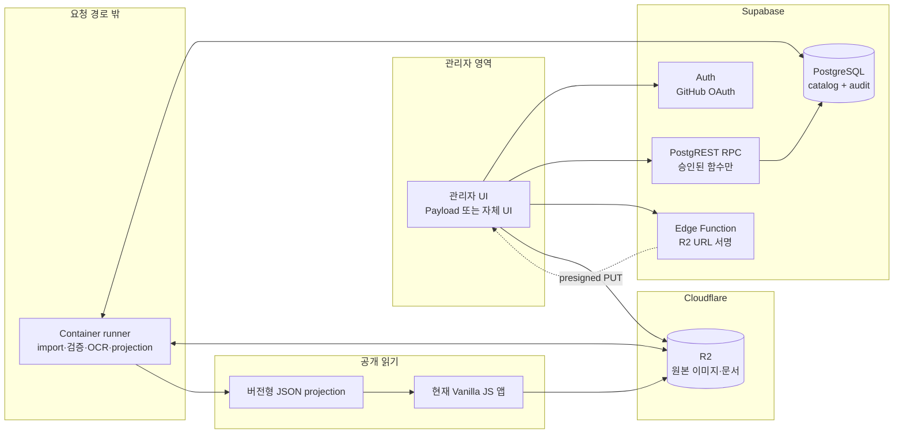

# 목표 서비스 설계도

이 문서는 [제품 비전](PRODUCT_VISION.md)을 운영 가능한 시스템 경계로 번역한다. 현재 정적
앱의 구현 구조는 [기술 아키텍처](ARCHITECTURE.md)가, 선택 근거는
[ADR-0008](adr/0008-supabase-minimum-service-baseline.md)이 소유한다.

## 1. 설계 목표

- 공식 근거가 연결된 제품 사실과 시스템 관계를 보존한다.
- 여러 관리자가 작성·검토·승인하되 자기 승인을 할 수 없게 한다.
- 원본 이미지와 문서는 변형 없이 다운로드할 수 있게 보존한다.
- 공개 카탈로그는 DB 장애나 관리자 기능과 독립적으로 빠르게 읽힌다.
- 조달 공고, 적용 사례, 기술·연혁은 제품 canonical을 덮어쓰지 않고 연결된다.
- 사실, 추출 후보, 사람의 검증, 파생 결과를 서로 다른 계층으로 유지한다.

## 2. 시스템 구성



## 3. 데이터 계층

| 계층 | 내용 | 변경 주체 | 배포 여부 |
| --- | --- | --- | --- |
| Raw evidence | 공식 PDF·ZIP·이미지·페이지 snapshot과 hash | 수집기 | 공개 앱 제외 |
| Staging | OCR·표 추출·후보 매핑·충돌 | runner | 제외 |
| Canonical | 제품·속성·관계·assertion·승인·감사 | 승인된 RPC | 직접 배포 안 함 |
| Derived | 역관계·검색 문서·facet·projection·thumbnail | runner | 재생성 가능 |
| Deployment | 공개 JSON·필요한 코드·승인된 media URL | CI | 포함 |

canonical에 반영되지 않은 extraction은 제품 사실이 아니다. 공개 화면은 staging을 읽지
않으며 런타임에서 canonical 오류를 보정하지 않는다.

## 4. 제품 변경 흐름

1. 관리자가 GitHub OAuth로 로그인한다.
2. 관리자 UI가 표시명·속성·관계 변경을 `change_request`와 operation으로 제출한다.
3. RPC는 JWT subject를 `app_user`에 매핑하고 DB의 현재 역할을 다시 확인한다.
4. DB는 허용된 상태 전이와 필수 evidence를 검사한다.
5. 다른 reviewer가 diff와 근거를 검토한다.
6. DB trigger가 작성자와 reviewer가 다른지 다시 검사한 뒤 상태를 `approved`로 바꾼다.
7. 적용 전까지 owner·maintainer는 사유를 기록하고 승인 요청을 취소할 수 있다.
8. maintainer 또는 자동 applier가 precondition을 다시 검사한다.
9. 적용 함수가 canonical 값, `applied` 상태와 audit log를 같은 transaction에서 기록한다.
10. runner가 새 projection과 이전 projection의 diff를 생성한다.
11. 품질 게이트가 통과하면 공개 projection pointer를 원자적으로 전환한다.
12. 실패하면 canonical은 유지하되 공개 pointer를 이전 버전으로 되돌린다.

## 5. 미디어 흐름

1. Edge Function이 역할과 허용 MIME·크기 정책을 확인한다.
2. 임시 key 하나에만 쓸 수 있는 짧은 presigned PUT URL을 발급한다.
3. 브라우저가 R2에 직접 원본을 업로드한다.
4. runner가 실제 SHA-256·MIME·크기·치수·alpha·금지 마크를 검사한다.
5. 검사 결과를 `media_asset` 후보와 연결한다.
6. reviewer 승인 후 immutable canonical key로 복사하고 placement를 적용한다.
7. 원본 파일명과 사용자 다운로드 파일명은 분리한다.
8. 교체된 asset은 즉시 삭제하지 않고 retired 상태와 참조 수를 기록한다.
9. 보존 기간이 지난 참조 0 object만 별도 GC 승인을 거쳐 삭제한다.

presigned PUT은 브라우저가 주장한 hash를 신뢰하지 않는다. 승격 전 runner의 실제 바이트
검사가 canonical identity를 결정한다.

## 6. 공개 읽기와 검색

공개 UI는 제품별 read document와 facet index를 한 projection version으로 받는다.

```text
canonical snapshot
  -> product read documents
  -> relation summaries
  -> normalized search text + facet values + deterministic sort key
  -> version manifest + content hashes
  -> atomic publish
```

projection에는 schema version, data version, 생성 시간, source snapshot ID를 넣는다. 검색,
필터, 정렬, 비교는 현재처럼 브라우저에서 수행하되 mid-range mobile에서 payload·parse time·
memory·filter latency를 측정한다. 전용 검색 서비스는 이 측정이 실패할 때만 추가한다.
초기 projection은 현재 `dist/`에 포함해 GitHub Pages에서 제공한다. 공개 media가 R2로
전환된 뒤 projection 호스팅 자체가 병목이면 R2 custom domain 또는 별도 정적 호스팅을
측정 후 선택한다.

## 7. 문서 수집과 extraction

Worker나 Edge Function은 긴 추출 작업을 실행하지 않는다.

1. scheduler가 수집 작업을 DB에 등록한다.
2. container runner가 작업을 claim하고 heartbeat를 기록한다.
3. 원문을 R2 raw key에 저장하고 hash로 중복을 판정한다.
4. OCR·표·문단 locator를 staging에 기록한다.
5. normalization이 단위와 속성 후보를 만들되 canonical을 수정하지 않는다.
6. 사람이 근거와 충돌을 검토한 뒤 change request를 제출한다.
7. 재시도 횟수, tool version, 입력 hash, 출력 hash를 job 기록에 남긴다.

공고 수집기는 공고 사실만 소유한다. 공고에 적힌 제품 사양이 canonical 제품 값을 직접
덮어쓰지 않는다.

## 8. 배포와 복구

- DB migration, runner, projection generator, 공개 UI는 서로 독립 배포 단위다.
- 공개 projection은 immutable version 경로와 작은 current pointer를 사용한다.
- DB migration 실패 시 배포를 중단하며 부분 적용을 허용하지 않는다.
- 승인 뒤 projection 생성이 실패하면 이전 공개 version을 유지한다.
- R2 object 승격 실패 시 DB transaction을 적용하지 않는다.
- pilot 기본 목표는 DB RPO 24시간 이내, 서비스 RTO 4시간 이내이며 hosted staging에서
  backup restore rehearsal 후 확정한다.

## 9. 관찰 가능성

최소한 다음 지표를 환경별로 기록한다.

- Auth 성공·실패와 관리자 차단
- RPC p50/p95/p99, 오류율, DB lock·slow query
- change request 대기 시간과 승인 실패 이유
- runner queue depth, 처리 시간, peak memory, retry, poison job
- projection 생성 시간·크기·diff·publish 실패
- R2 저장량, Class A/B operation, egress, orphan·retired object
- 월 예산 대비 실제 비용과 임계치 알림

## 10. 아직 확정하지 않은 것

- 관리자 UI: Payload 또는 자체 React·TypeScript
- hosted Supabase 리전과 한국 p95
- container runner 공급자와 최소 메모리·시간
- projection publish 주기와 event 방식
- pilot 이후 projection 호스팅 위치
- pilot 이후의 RPO/RTO와 PITR 예산
- Workers·Hyperdrive 도입 임계치

이 항목은 [서비스 이행 계획](SERVICE_DELIVERY_PLAN.md)의 실험 결과로만 결정한다.
