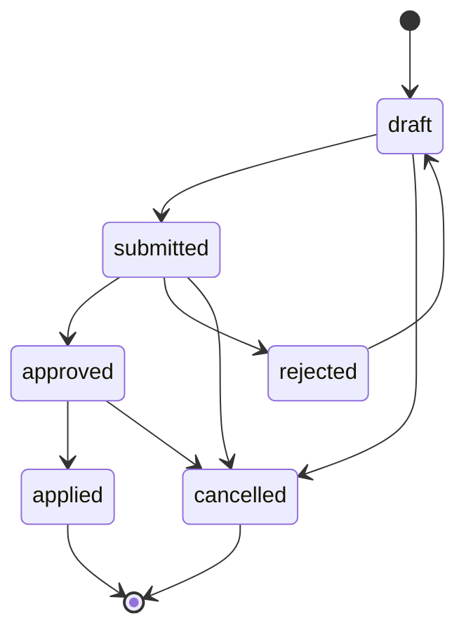

# 서비스 보안·승인·감사 설계

이 문서는 목표 서비스의 신뢰 경계를 정의한다. 현재 정적 앱의 CSP와 preview 경계는
[품질 게이트](quality-gates.md)가 계속 검증한다.

## 1. 보호 대상

- canonical 제품 사실, 관계, evidence, lifecycle
- 관리자 identity, 역할, 세션, 승인 권한
- change request, before/after 값, audit log
- 공식 원본 파일, hash, 권리와 출처
- Supabase DB 비밀번호·service role, R2 credential, OAuth secret
- 공개 projection과 current version pointer

## 2. 신뢰 경계

- 브라우저는 신뢰하지 않는다. 화면에서 숨긴 버튼은 권한 통제가 아니다.
- Supabase Auth는 identity만 증명한다. 앱 역할은 매 요청마다 DB에서 확인한다.
- `catalog` 테이블은 `anon`, 일반 `authenticated`, `service_role`의 직접 쓰기를 허용하지
  않는다.
- canonical write는 고정된 RPC 함수와 runner 전용 최소 권한 role만 수행한다.
- Edge Function은 presigned URL 발급 외에 canonical 값을 결정하지 않는다.
- runner의 extraction 결과는 staging 후보이며 reviewer 승인 전에는 사실이 아니다.

## 3. 역할과 분리

| 역할 | 허용 | 금지 |
| --- | --- | --- |
| owner | 관리자 초대·역할·비상 복구 승인 | 감사 로그 수정 |
| maintainer | 적용·운영·projection 관리 | 자기 요청 승인 |
| editor | draft·근거·변경 요청 작성 | canonical 직접 변경·승인 |
| reviewer | diff·근거 검토와 승인·거절 | 자기 요청 승인·역할 부여 |
| runner service principal | claim한 import/extraction/projection 작업 | 사용자 역할·승인 결정 |

한 사용자가 여러 역할을 가질 수 있어도 요청의 `author_id`와 approval의 `reviewer_id`는
항상 달라야 한다. UI, RPC, DB trigger 세 곳이 같은 규칙을 검사한다.

runner는 `app_user`가 아닌 별도 DB service principal이다. 승인된 작업을 처리할 수 있지만
reviewer가 되거나 change request의 승인 상태를 결정할 수 없다.

## 4. 변경 상태 기계

허용되지 않은 전이는 DB에서 실패한다. `approved`는 필요한 reviewer 수와 evidence 정책을
충족한 검토 완료 상태다. owner·maintainer는 적용 전에만 사유와 함께 취소할 수 있다.
`applied`는 maintainer 또는 자동 applier가 precondition을 다시 검사하고 canonical 변경과
audit insert를 같은 transaction에서 성공시켰을 때만 가능하다. 적용 뒤 되돌리기는 기존
요청 상태를 변경하지 않고 새 change request로 수행한다.

## 5. 감사 불변성

- audit log는 INSERT만 허용한다.
- UPDATE, DELETE, TRUNCATE를 trigger와 DB grant로 차단한다.
- canonical mutation 함수가 before/after·actor·request·timestamp·context를 자동 기록한다.
- UI나 runner가 임의 audit payload를 작성하지 않는다.
- canonical assertion은 product·manufacturer·relation·media의 명시적 FK 중 정확히 하나를
  사용한다. audit와 미적용 change operation의 typed key는 적용 함수가 사전 검증한다.
- DB owner가 수행한 비상 작업은 별도 외부 운영 로그와 incident ID를 남긴다.
- 정기적으로 audit chain 개수·연속성·change request 연결을 검사한다.

## 6. 인증과 세션

- 초기 로그인은 GitHub OAuth allowlist 또는 초대된 identity만 허용한다.
- GitHub, Supabase, Cloudflare 계정은 2FA를 요구한다.
- JWT의 issuer, audience, signature, expiry를 검증한다.
- `app_user.disabled_at`과 현재 역할을 매 privileged RPC에서 확인한다.
- 역할 변경·비활성화 시 기존 세션의 허용을 서버에서 즉시 차단한다.
- OAuth secret, DB credential, R2 key는 환경 secret store에만 둔다.

## 7. R2 업로드 위협

| 위협 | 통제 |
| --- | --- |
| 임의 key 덮어쓰기 | UUID 임시 prefix 하나에만 PUT 허용 |
| URL 재사용 | 짧은 만료, 1회 등록, 이미 사용한 key 거부 |
| MIME 위장 | magic bytes와 decoder로 재검사 |
| hash 위장 | runner가 실제 바이트 SHA-256 계산 |
| 과대 파일·압축 폭탄 | 업로드 정책, 압축 전후 크기·파일 수·깊이 제한 |
| 홍보 배지·콜아웃 | 이미지 정책 검사와 reviewer 승인 |
| 고아 object | staging TTL과 canonical reference 감사 |
| 원본 손실 | immutable key, checksum, 복제·backup 정책 |

## 8. 주요 위협과 검증

| 위협 | 방어 | 필수 테스트 |
| --- | --- | --- |
| 자기 승인 | author/reviewer DB trigger | 동일 UUID approval 거부 |
| 직접 테이블 쓰기 | schema revoke + RPC allowlist | 모든 브라우저 role의 INSERT/UPDATE 거부 |
| 불법 상태 전이 | DB 상태 기계 | draft→applied 직접 변경 거부 |
| 감사 삭제 | grant + UPDATE/DELETE/TRUNCATE trigger | 세 연산 모두 거부 |
| 근거 없는 verified | assertion-evidence FK와 검증 query | evidence 없는 verified 실패 |
| 중복 요청 | idempotency key unique | 같은 key의 재시도 결과 동일 |
| 오래된 projection | version pointer + hash | DB snapshot과 manifest 불일치 실패 |
| 악성 문서 | 격리 runner, resource limit | timeout·OOM·zip bomb fixture |
| 공개 API 남용 | rate limit·cache·size limit | 임계치 초과 429와 로그 |

## 9. 계정 생성 전 결정

- Supabase 리전과 dev/staging/prod 분리
- 관리자 초대·allowlist·탈퇴 절차
- JWT asymmetric key와 rotation 절차
- R2 bucket·custom domain·CORS·credential scope
- secret owner와 비상 회수 담당자
- pilot RPO/RTO·PITR·비용 상한
- 오류·보안 알림을 받을 채널
